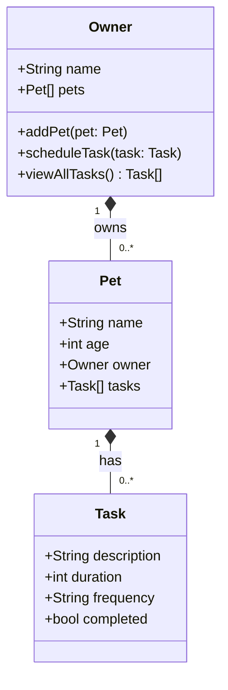

```mermaid
classDiagram
    class Task {
        +String description
        +int duration
        +String frequency
        +bool completed
    }

    class Owner {
        +String name
        +Pet[] pets
        +addPet(pet: Pet)
        +scheduleTask(task: Task)
        +viewAllTasks() Task[]
    }

    class Pet {
        +String name
        +int age
        +Owner owner
        +Task[] tasks
    }

    Owner "1" *-- "0..*" Pet : owns
    Pet "1" *-- "0..*" Task : has
```
