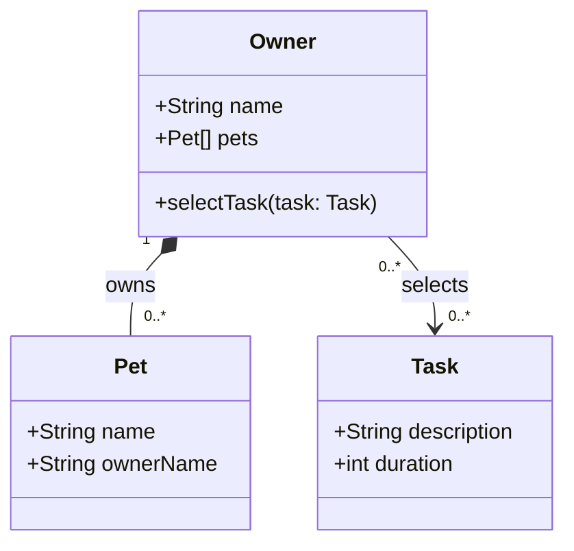

```mermaid
classDiagram
    class Task {
        +String description
        +int duration
    }

    class Owner {
        +String name
        +Pet[] pets
        +selectTask(task: Task)
    }

    class Pet {
        +String name
        +String ownerName
    }

    Owner "1" *-- "0..*" Pet : owns
    Owner "0..*" --> "0..*" Task : selects
```
